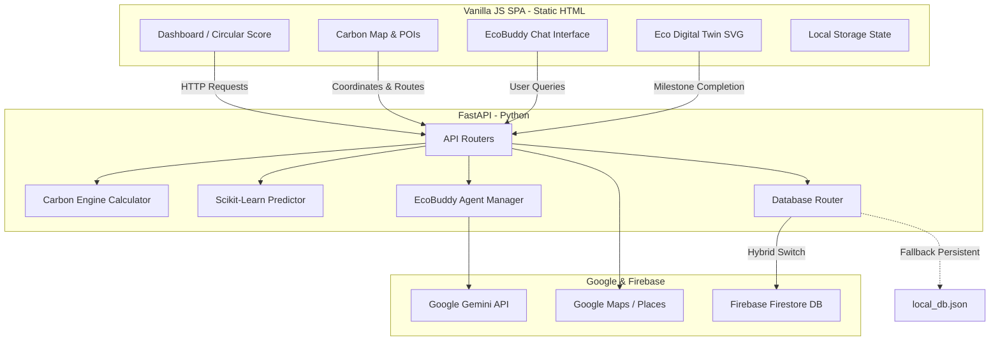

# EcoAI Guardian - AI-Powered Carbon Reduction Assistant

**EcoAI Guardian** is a production-ready, full-stack climate action application designed to help individuals understand, track, and reduce their personal carbon footprint. It behaves like a personal environmental coach by leveraging user habits, location intelligence, machine learning forecasting, and Google Cloud Services.

---

## 1. Problem Statement
Global greenhouse gas emissions continue to rise, and while individuals express a desire to reduce their carbon footprints, they lack **personalized, actionable, and context-aware data**. Typical calculators provide flat yearly estimations but do not account for daily commuting decisions, changing weather patterns, or local green amenities. 

## 2. Chosen Vertical
* **Climate and Sustainability**

## 3. Solution Explanation
EcoAI Guardian closes the gap between intention and action by creating an active **sustainability coaching loop**:
1. **Interactive Tracking**: Users log daily commute, food, energy, and waste habits.
2. **Context-Aware Analytics**: It calculates precise emissions using distance metrics and energy sources.
3. **Machine Learning Predictions**: A `scikit-learn` forecasting model analyzes user history, location, and seasonal climate shifts to predict next month's carbon footprint.
4. **AI Coaching (EcoBuddy)**: Powered by **Google Gemini**, EcoBuddy reads user context, identifies carbon spikes, and recommends customized reduction roadmaps.
5. **Real-Time Carbon Maps**: Incorporates Google Maps & Places to analyze travel coordinates and find local EV charging points, bus stations, or recycling hubs.
6. **Gamified Sprints**: Streaks, points, level-ups, and badges keep users engaged.

---

## 4. System Architecture



---

## 5. Technology Stack
* **Frontend**: Vanilla HTML5, CSS3, & Modern JS (Chart.js, Tailwind CSS, Lucide Icons, Canvas-Confetti).
* **Backend**: Python FastAPI, Uvicorn (ASGI server), Scikit-Learn (Predictive models), Pandas/Numpy (Data handling).
* **Database & Auth**: Firebase Firestore (Hybrid mode supports local JSON state if unconfigured).
* **AI & Location Services**: Google Gemini API (`gemini-1.5-flash`), Google Maps JavaScript API, Directions API, and Places API.

---

## 6. Features
1. **Personal Carbon Calculator**: Logs daily travel (km/mode), energy (kWh/source), meals (diet preferences), and shopping to yield a **Carbon Score out of 100**.
2. **EcoBuddy Chatbot**: Context-aware Gemini sustainability advisor with simulated conversational fallback.
3. **Real-Time Carbon Map**: Visualizes pollution zones, green parks, and sustainable POIs.
4. **AI Footprint Predictor**: Scikit-learn Linear Regression model forecasting next month's emissions based on seasonality.
5. **Eco Digital Twin**: Interactive SVG tree avatar that grows and blossoms as carbon scores improve, alongside a personalized weekly milestone roadmap.
6. **Community Leaderboard**: Gamified rankings based on **Carbon Saved** instead of carbon produced.

---

## 7. Installation & Setup

### Prerequisites
* Python 3.9+ (Python 3.13 supported)

### Launch Steps
1. Navigate to the backend directory:
   ```bash
   cd backend
   ```
2. Install Python dependencies:
   ```bash
   pip install -r requirements.txt
   ```
3. Copy `.env.example` to `.env` and fill in your API keys (optional; the app falls back to simulation mode if keys are empty):
   ```bash
   copy .env.example .env
   ```
4. Run the FastAPI dev server:
   ```bash
   python main.py
   ```
5. Open your browser and navigate to: `http://localhost:8000` (the backend automatically hosts the frontend assets at the root).

---

## 8. Quality Checks

Run these before submission:

```bash
python -m pytest
python -m ruff check . --no-cache
```

Current verified status:
* 19 automated tests passing across API, validation, security headers, carbon calculations, predictions, and local persistence.
* Ruff static analysis passing with no lint violations.
* Runtime state, local secrets, caches, and compiled Python artifacts excluded from Git, Docker, and Google Cloud uploads.

---

## 9. API Setup Instructions

* **Google Gemini API Key**: Get a key from the [Google AI Studio](https://aistudio.google.com/). Set `GEMINI_API_KEY` in `backend/.env`.
* **Google Maps API Key**: Set up a project in [Google Cloud Console](https://console.cloud.google.com/), enable the *Maps JavaScript API*, *Directions API*, and *Places API*, and generate an API key. Set `GOOGLE_MAPS_API_KEY` in `backend/.env`.
* **Firebase Firestore & Auth Service Account**: Create a project in [Firebase Console](https://console.firebase.google.com/). In Project Settings -> Service Accounts, select Python and click *Generate new private key*. Save the JSON file and set `FIREBASE_CREDENTIALS` to its absolute file path.

---

## 10. Security & Privacy
1. **User Location Control**: User coordinates are only analyzed locally in the browser or sent to Maps APIs with explicit user permission. A location consent settings card is provided.
2. **Hardened API Defaults**: CORS is restricted through `CORS_ALLOWED_ORIGINS`, HTTP security headers are applied, and string inputs are validated against basic script injection patterns.
3. **Encrypted Operations**: Firestore database access rules block unauthorized readers. In Demo Mode, information is kept locally in `backend/local_db.json`.
4. **Data Deletion**: In compliance with privacy standards, a "Delete My Environmental Profile" button clears all user profiles, logs, and Eco Twin states from memory and disk.

---

## 11. Future Improvements
* **Automated Smart Meter Integration**: Connect smart meters (e.g. Sense) to automate electricity logging.
* **Wearable Health Sync**: Read steps directly from Google Fit or Apple Health to automatically log walking offsets.
* **Collaborative Challenges**: Enable users to form clubs and participate in team vs team sustainability brackets.
